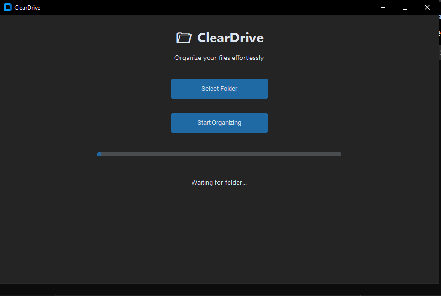

# ClearDrive 🗂️

> Turn your chaotic folders into a clean, organized archive.

A modern desktop application that automatically organizes files into a structured folder hierarchy based on metadata—built with Python.




## The Problem

Most families have years of photos, videos, documents and phone backups scattered across multiple drives with no structure.

Folders named "kachra", "Random", "New Folder (2)", mixed with office documents and WhatsApp forwards — all in one place.

No tool solved this completely:
- Google Photos → cloud only, photos only
- Other organizers → photos only, ignores documents
- Local AI tools → needs expensive GPU

**ClearDrive solves it entirely, locally.**

---

## What It Does

- 📅 Sorts files by **actual capture date** (EXIF metadata, not modified date)
- 📁 Organizes into **Year → Month → Category** structure
- 👨‍👩‍👧‍👦 Separates **phone backups by person** (fully customizable)
- 🔍 Detects **duplicates by content fingerprint** (not just filename)
- 📱 Keeps **WhatsApp media separate** (unreliable metadata)
- 🔒 **Copy mode by default** — originals never touched
- ✅ **Dry run mode** — preview everything before committing

---

## Output Structure

```
Organized/
├── 2022/
│   ├── 06 - June/
│   │   ├── Photos/
│   │   ├── Videos/
│   │   ├── Documents/
│   │   └── Audio/
│   └── 11 - November/
│       └── Photos/
├── WhatsApp/
│   ├── Photos/
│   └── Videos/
└── _Duplicates/
```

Phone Backup Output:
```
Phone_Backups_Organized/
├── Person1/
│   ├── Photos/
│   ├── Videos/
│   ├── Documents/
│   ├── Audio/
│   ├── Other/
│   └── Skipped/
├── Person2/
└── Person3/
```

---

## Installation

**Step 1 — Install Python 3.7+**  
Download from [python.org](https://python.org/downloads)  
⚠️ During install, tick **"Add Python to PATH"**

**Step 2 — Install dependency**
```bash
pip install Pillow
```

**Step 3 — Download scripts**  
Download `organizer.py` and `phone_backup_extractor.py` from this repo and save them anywhere on your PC (e.g. `C:\ClearDrive\`)

---

## Usage

### 1. Family Drive Organizer (`organizer.py`)

**How to find your folder paths (Windows):**
1. Open File Explorer
2. Navigate to the folder you want to include
3. Click the address bar at the top — it shows the full path
4. Example: `D:\Photos` or `E:\WhatsApp`

**Always dry run first — nothing moves, just previews:**
```bash
python organizer.py --source "D:\Photos" "D:\kachra" "D:\WhatsApp" --output "G:\Family" --dry-run
```

**Actual run (copy mode — originals untouched):**
```bash
python organizer.py --source "D:\Photos" "D:\kachra" "D:\WhatsApp" --output "G:\Family"
```

**Move instead of copy:**
```bash
python organizer.py --source "D:\Photos" --output "G:\Family" --move
```

**Multiple source folders:**
```bash
python organizer.py --source "D:\Camera" "D:\Downloads" "D:\TRIPS" "D:\Events" --output "G:\Family"
```

> 💡 **Tip:** If output folder is inside a source folder, the script automatically skips it to avoid infinite loops.

---

### 2. Phone Backup Extractor (`phone_backup_extractor.py`)

Extracts and organizes phone backups by person into separate folders.

**Step 1 — Edit PERSON_MAP to match your folders**

Open `phone_backup_extractor.py` in Notepad and edit this section:

```python
PERSON_MAP = {
    'samsung_backup':    'Person1',   # folder name (lowercase) → person label
    'photo backup':      'Person1',
    'full phone backup': 'Person2',
    'august 2025_p3':    'Person3',
}
```

> The key is part of your folder name in **lowercase**. The value is whatever label you want.  
> Example: if your folder is called `John_Samsung_2024`, add `'john_samsung': 'John'`

**Step 2 — Dry run:**
```bash
python phone_backup_extractor.py --dry-run
```

**Step 3 — Actual run:**
```bash
python phone_backup_extractor.py
```

**Custom source/output paths:**
```bash
python phone_backup_extractor.py --source "D:\Phone_Backups" --output "G:\Phone_Backups_Organized"
```

---

## Understanding the Output

| Folder | What goes here |
|---|---|
| `Photos/` | jpg, png, heic, raw etc |
| `Videos/` | mp4, mov, avi etc |
| `Documents/` | pdf, docx, xlsx etc |
| `Audio/` | mp3, amr, m4a, call recordings etc |
| `WhatsApp/` | anything from a WhatsApp folder |
| `_Duplicates/` | exact duplicate files (kept, not deleted) |
| `Skipped/` | junk files — .db, .json, tiny cache files |

---

## Supported File Types

| Category | Extensions |
|---|---|
| Photos | jpg, jpeg, png, gif, bmp, tiff, heic, heif, webp, raw, cr2, nef, arw |
| Videos | mp4, mov, avi, mkv, wmv, flv, 3gp, m4v, webm, mpg |
| Audio | mp3, wav, aac, m4a, ogg, flac, amr, opus, wma |
| Documents | pdf, doc, docx, xls, xlsx, ppt, pptx, txt, csv, odt, rtf |

---

## Real World Results

Ran on a real family drive:
- **25,221 files** processed
- **940 duplicates** detected and separated
- **12,797 WhatsApp** files kept separate
- **0 errors**

---

## Roadmap

- [ ] GUI — drag and drop folder selection (no CMD needed)
- [ ] Family Worthy processor — shared dump folder auto-sorted into main archive
- [ ] Resume interrupted runs
- [ ] Config file support

---

## Why Local?

Family photos and documents are private.  
They should stay that way.  
ClearDrive never touches the internet.

---

## License

MIT — free to use, modify, share.

---

*Built by [Abhinav Pratap Singh](https://github.com/abhi-9-av) — 18 y/o, Kanpur*  
*Because our family drive had a folder named "kachra" and I got tired of it.*
